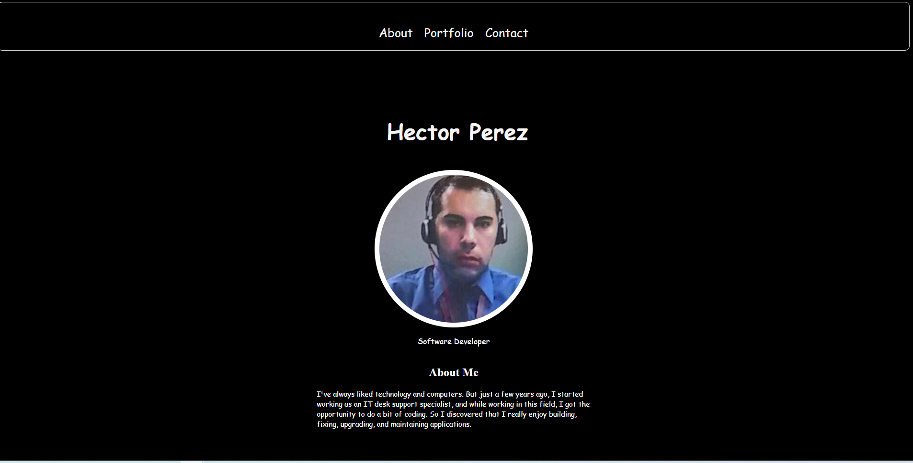
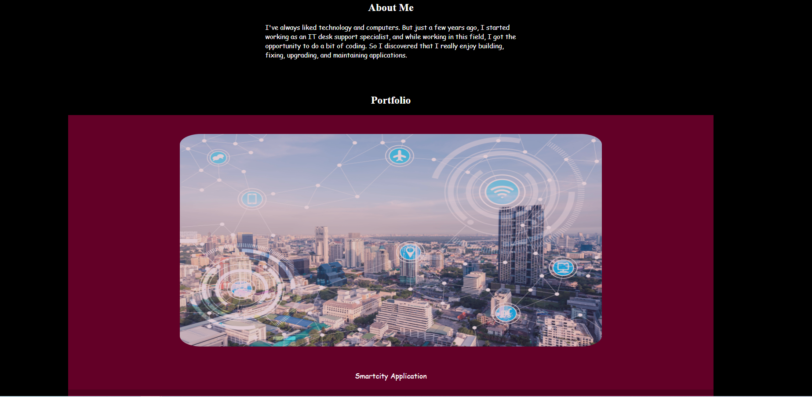
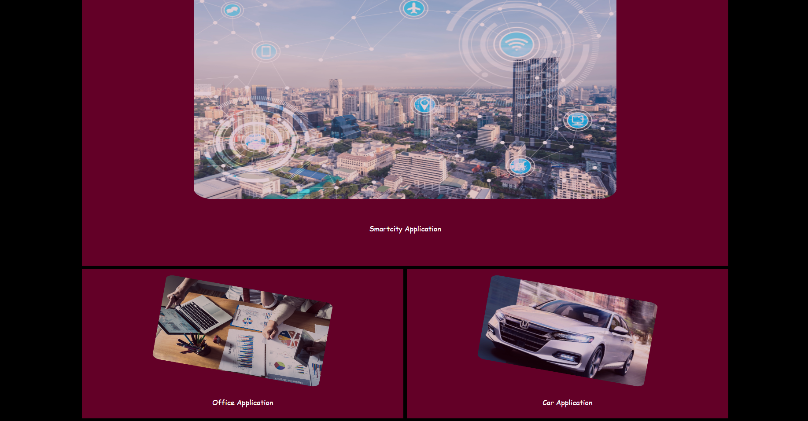

# 02-challenge-repository
This repository hosts the 02 challenge

## This repo shows my portfolio page. I added some of the following items:  
 

- Added a professional photo on the page
- Use semantics like header, nav, main, articles, aside and a footer.
- Added hover background-color change when user hovers on the links
- Refactored styles
- Added home, about, projects, captstone links and created In progress page.
- Added variables
- Added opacity to the main image when hovering
- Added figure elements
- Added contact information and media icons
- Added header and nav screenshot

## Sreenshots of the web page ##

### Links ###

https://noviceprogrammeroh.github.io/02-challenge-repository/

